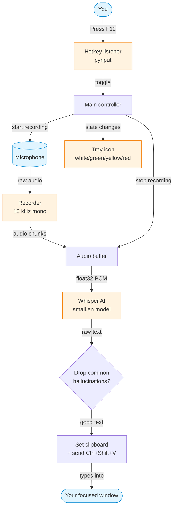

# Bol

**Press a key. Speak. Your words appear.**

`bol` is a voice-to-text tool for Linux. Hit a hotkey, talk, hit it again, and your words get typed into whatever app you're using — your browser, your editor, a chat window, anywhere.

Everything runs on your own computer. No internet, no cloud, no API keys. Your voice never leaves your machine.

---

## What it does

- 🎙️ **One-key dictation** — press `F12` to start, press it again to stop.
- 📋 **Pastes anywhere** — works in any app: VS Code, Chrome, terminal, Slack.
- 🔒 **100% offline** — uses [faster-whisper](https://github.com/SYSTRAN/faster-whisper) locally on your CPU.
- 🟢 **Tray icon** — a little mic icon shows what's happening:
  - **white** = waiting
  - **green** = listening to you
  - **yellow** = converting speech to text
  - **red** = something went wrong
- 🧹 **Smart filter** — drops Whisper's common hiccups like "thanks for watching" or random "you".
- 📎 **Keeps your clipboard** — whatever you had copied stays copied.

---

## Will it work on my computer?

You need:

- **Ubuntu** (or another Linux) running an **X11 session** — *not* Wayland.
- Python 3.12+
- A working microphone

### Check your session type

Open a terminal and run:

```bash
echo $XDG_SESSION_TYPE
```

- Says `x11`? ✅ You're good.
- Says `wayland`? ⚠️ You need to switch. Log out, click the ⚙️ gear icon at the login screen, and choose **"Ubuntu on Xorg"**, then log back in.

| Ubuntu version | What you get by default | What to do |
|---|---|---|
| 20.04 | X11 | Nothing — just install. |
| 22.04 | Wayland (GNOME) | Pick "Ubuntu on Xorg" at login. |
| 23.04 / 24.04 | Wayland | Pick "Ubuntu on Xorg" at login. |

> Why? Wayland blocks apps from typing into other windows for security reasons. `bol` needs that ability to paste your words.

---

## Install

### 1. Install the system bits

```bash
sudo apt install portaudio19-dev xclip xdotool python3-venv
```

### 2. Get the code

```bash
git clone <this-repo> ~/bol
cd ~/bol
```

### 3. Set up Python

```bash
python3 -m venv venv
source venv/bin/activate
pip install sounddevice numpy faster-whisper pynput pillow pystray python-xlib
```

The first time you run `bol`, it downloads the Whisper speech model (~460 MB). After that it starts in seconds.

### 4. Make the `bol` command available

Create a small launcher so you can run `bol` from anywhere:

```bash
cat > ~/.local/bin/bol << 'EOF'
#!/bin/bash
cd "$HOME/bol" || exit 1
source venv/bin/activate
exec python voice_type.py "$@"
EOF
chmod +x ~/.local/bin/bol
```

That's it.

---

## How to use it

### Start the service

In any terminal, just run:

```bash
bol
```

You'll see:

```
[mic] Using device 7: pulse
[...] Loading small.en model...
[...] Warming up...
[✓] Ready.
```

A white mic icon shows up in your system tray. **Leave the terminal open** — that's where the service is running.

### Dictate

1. Click into the window where you want text to appear.
2. Press **`F12`** (or **`Pause/Break`** on a full-size keyboard).
3. The tray icon turns **green** — start talking.
4. Press the hotkey again. The icon goes **yellow** for a second, then **white**, and your words get pasted in.

That's the whole loop.

### Stop the service

- Right-click the tray icon → **Quit**, or
- Press `Ctrl+C` in the terminal where it's running.

### Run it in the background

If you don't want a terminal window hanging around:

```bash
nohup bol > ~/.bol.log 2>&1 &
disown
```

Now `bol` runs detached. To stop it later: right-click the tray icon → Quit.

### Start automatically when you log in

Create this file at `~/.config/autostart/bol.desktop`:

```ini
[Desktop Entry]
Type=Application
Name=bol
Exec=/home/YOUR_USERNAME/.local/bin/bol
X-GNOME-Autostart-enabled=true
```

Replace `YOUR_USERNAME` with your actual username. Now `bol` starts every time you log in.

---

## How it works under the hood



**The flow in plain English:**

1. You press the hotkey → a background listener notices.
2. `bol` opens your microphone and starts collecting audio.
3. You press the hotkey again → recording stops.
4. The audio gets fed to Whisper, running locally on your CPU.
5. Whisper returns text. If it's obvious junk ("you", "bye"), it's dropped.
6. The text goes into your clipboard, and `bol` simulates `Ctrl+Shift+V` to paste it where your cursor is.
7. Your old clipboard contents are restored half a second later.

---

## Tweaking it

All settings live at the top of `voice_type.py`:

| Setting | Default | What it does |
|---|---|---|
| `INPUT_DEVICE` | `7` | Which microphone to use. Run the snippet below to see your options. |
| `HOTKEYS` | `<f12>`, `<pause>` | What keys trigger recording. Use `pynput` syntax. |
| `MODEL_SIZE` | `small.en` | `base.en` is faster, `medium.en` is more accurate. |
| `BEAM_SIZE` | `1` | Bump to `5` for slightly better accuracy at a small speed cost. |
| `HALLUCINATIONS` | a set of phrases | Words/phrases to silently drop. Add your own. |

**To list your microphones:**

```bash
python -c "import sounddevice as sd; print(sd.query_devices())"
```

Pick the index of the device you want and put it in `INPUT_DEVICE`. If your headset doesn't natively support 16 kHz, use the index for `pulse` — it'll resample for you.

---

## Something went wrong?

**`PortAudio library not found`**
> Install it: `sudo apt install portaudio19-dev`

**`Invalid sample rate [PaErrorCode -9997]`**
> Your microphone doesn't support 16 kHz directly. Switch `INPUT_DEVICE` to your `pulse` device — it handles the conversion.

**Tray icon stays white forever / nothing happens when I press F12**
> Make sure you're on X11, not Wayland. Run `echo $XDG_SESSION_TYPE` to check.

**The transcription comes out empty or just `.`**
> Your mic is too quiet. Check:
> 1. Is the headset's hardware mute on? (Sennheiser headsets often mute when the boom is rotated up.)
> 2. Run `pactl set-source-volume @DEFAULT_SOURCE@ 100%` to crank the gain.
> 3. Move the mic closer to your mouth.

**Text pastes into the wrong window**
> `bol` pastes into whatever window has keyboard focus. Click the target *first*, then press the hotkey.

**`UnicodeEncodeError` from pystray**
> Fixed in this version, but if you customize the tray title, stick to plain ASCII (no em-dashes, ellipses, or emoji).

---

## What's been built

This project went through four milestones:

1. **Record** — capture mic audio to a WAV file.
2. **Transcribe** — toggle recording with a hotkey, convert speech to text with Whisper.
3. **Type** — paste the text into the focused window automatically.
4. **Polish** — tray icon, error states, hallucination filtering, clipboard preservation, multi-hotkey support.

The end result is `voice_type.py`. Everything else is dead weight.

---

## License

MIT — do whatever you want with it.
